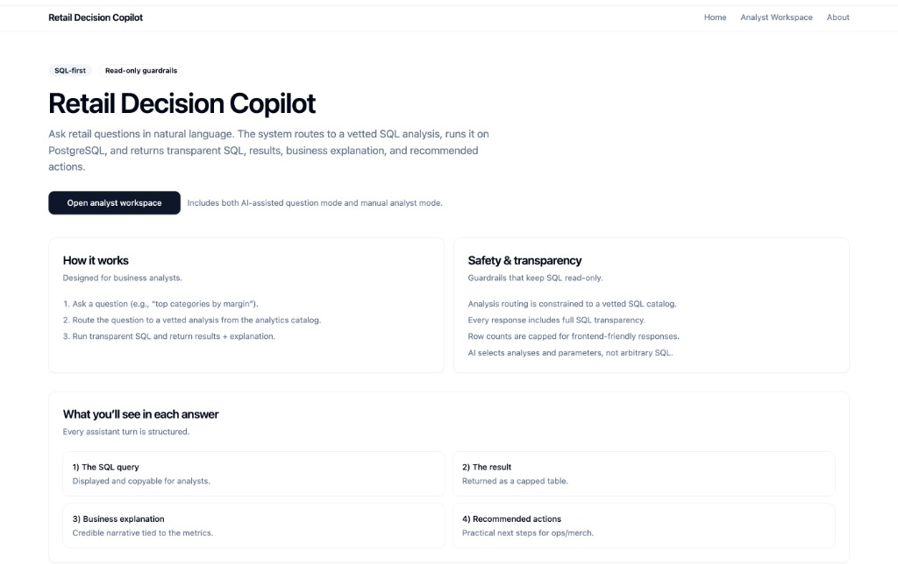
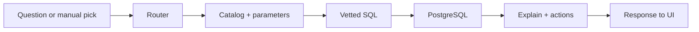

# Retail Decision Copilot

**A SQL-first retail analytics app** where you can ask business questions in plain language or run analyses by hand and always see the **exact PostgreSQL** behind the answer, plus a short business readout and suggested next steps.



---

## Short overview

Retail Decision Copilot is a portfolio project aimed at **data analyst and business analyst** workflows: revenue, margin, promotions, inventory risk, returns, and supplier performance backed by a realistic retail schema, **parameterized analyst-grade SQL**, and a small **AI routing layer** that maps questions to those vetted queries (it does **not** generate arbitrary SQL).

The UI is a clean **analyst workspace** (not a dashboard): natural language mode, manual mode, transparent SQL, and tabular results.

---

## Why I built this

I wanted something that feels like **real analyst work** where the hard part is framing the question, choosing the right grain, and trusting the numbers—while still being **honest about how AI fits in**.

A lot of “AI analytics” demos hide the query layer. That makes for a flashy story but a weak interview story. Here, **SQL stays center stage**: window functions, CTEs, rankings, and time comparisons live in real modules you can read and defend. The AI piece is deliberately narrow: **pick an analysis and parameters from a catalog**, then let Postgres do what Postgres is good at.

That combination—**transparent SQL, safe routing, business-facing copy**—matches how I think about shipping analytics in practice: show your work, constrain the risky parts, and make outputs useful for someone who isn’t staring at the database all day.

---

## What the application does

1. **AI question mode** - You type a retail-style question. The backend selects one of **22** predefined analyses and fills parameters (with validation and safe defaults). You get the **SQL**, **rows**, **timing metadata**, a **short explanation**, and **recommended actions** grounded in what came back.

2. **Manual analysis mode** - You choose an analysis from the catalog, set parameters yourself, and run it. Same execution path and same transparency—useful for demos and for comparing “what I meant” vs “what the model chose.”

The landing and **About** pages frame the product; the **Analyst Workspace** (`/app`) is where the work happens.

---

## Key features

- **SQL you can inspect** — Every run returns the query text alongside results.
- **Catalog-only execution** — Analyses are registered in code; the API validates names and parameters before anything hits the database.
- **Dual mode** — Natural language + manual analyst path without hiding the SQL-first design.
- **Synthetic but realistic data** — Deterministic seed data across regions, stores, categories, suppliers, products, promotions, sales, inventory snapshots, returns, and replenishment—tuned so common windows return meaningful rows.
- **Production-shaped layout** — Next.js frontend, FastAPI backend, Postgres (e.g. Neon), with deployment notes for Vercel + Render.

---

## How the system works



**Routing (the honest version):**

1. **Keyword heuristics** run first for obvious intents (e.g. promotion + margin → promotion effectiveness). This keeps demos usable when phrasing is clear.
2. If heuristics do not apply, **OpenAI** (Responses API) suggests an `analysis_name` and parameters from the **published catalog**—not free-form SQL.
3. The server **validates** the choice, coerces types, fills missing required fields from **deterministic defaults** aligned with the seeded date range, and **falls back** to a safe default analysis (`revenue_by_month`) if the model output is missing, invalid, or the API is unavailable (e.g. no key, quota, or network error).

**What the AI does *not* do:** it does **not** author arbitrary `SELECT` statements or touch tables outside the curated analysis layer.

**Explanations** are **rule-based** and tied to the selected analysis and result shape (including empty results)—so narrative stays grounded and inspectable, not a black-box second model pass.

---

## Tech stack

| Layer | Choice |
|--------|--------|
| Frontend | Next.js (App Router), TypeScript, Tailwind CSS, shadcn/ui |
| Backend | FastAPI, Pydantic v2, SQLAlchemy 2.x, Alembic |
| Database | PostgreSQL (local or **Neon** in production) |
| AI | OpenAI **Responses API** — routing to catalog entries only |
| Hosting | **Vercel** (web), **Render** (API via Docker), **Neon** (DB) |

---

## Architecture overview

Monorepo (npm workspaces):

- **`apps/web`** — `@rdc/web`: Next.js UI (landing, about, analyst workspace at `/app`).
- **`apps/api`** — `@rdc/api`: FastAPI app, analytics SQL, AI router, query/explanation services.
- **`packages/shared`** — Shared contracts/types as the repo grows.
- **`scripts`** — Database seed and helpers (e.g. `scripts/seed_db.py`).
- **`infra/deploy`** — Render and Vercel deployment notes; **`infra/docker`** — local container baseline.

**API surface (high level):**

- `GET /healthz` — Liveness for platforms like Render.
- `GET /analytics` — List analyses and parameter specs.
- `POST /analytics/run` — Run a catalog analysis with parameters.
- `POST /query` — Natural-language question → routed analysis → same execution path as manual mode.

**CI:** GitHub Actions runs `make lint` and `make test` on push/PR. Backend tests cover health, analytics, and query routing; frontend test script is still a lightweight placeholder.

---

## Data model and analytics scope

**Schema (10 tables):** regions, stores, categories, suppliers, products, promotions, sales, inventory snapshots, returns, replenishment orders—enough to practice joins, time windows, margin math, inventory stress, returns, and supplier lead-time behavior.

**22 parameterized analyses** (themes include):

- Revenue by day / week / month  
- Gross margin by category, store, product  
- Discount impact; promotion effectiveness  
- Stockout risk; products near reorder; sell-through  
- Return rates by category and product  
- Supplier delay analysis  
- Top / bottom products; store vs region comparison  
- Month-over-month and week-over-week revenue change  
- Category contribution to revenue  
- Low-margin high-volume products; high-returns low-margin products  

SQL lives under `apps/api/app/sql/analytics/` with a registry in `registry.py`. Deeper schema and SQL examples also appear in `apps/api` markdown docs (e.g. retail schema and analyst SQL notes).

---

## Example business questions

Questions the routing layer and catalog are designed to support (exact mapping depends on phrasing and parameters):

- “How did revenue trend month over month in late 2025?”
- “Which categories had the strongest gross margin last quarter?”
- “Where did discounts erode margin the most?”
- “Which promotions helped revenue but pressured margin?”
- “Which stores are closest to stockout risk?”
- “Who are our chronically late suppliers?”
- “Which products combine high returns with weak margin?”
- “How does this store compare to its region on revenue?”

---

## Local setup

**Prerequisites:** Node 20+, Python 3.12+, PostgreSQL (local or Neon), and optionally OpenAI credentials for AI routing.

1. **Clone and install**

   ```bash
   git clone <repo-url>
   cd retail-decision-copilot
   npm install
   ```

2. **Configure environment**

   Copy [`.env.example`](.env.example) to `.env` at the repo root (and/or set variables in your shell). Important values:

   - `DATABASE_URL` — Use `postgresql+psycopg://...` (see example for Neon + `sslmode=require`).
   - `NEXT_PUBLIC_API_BASE_URL` — e.g. `http://localhost:8000` for local API.
   - `OPENAI_API_KEY` / `OPENAI_MODEL` — Optional for local dev; without them, routing falls back deterministically.

3. **Backend: migrate and seed**

   ```bash
   cd apps/api
   python3 -m venv .venv
   source .venv/bin/activate   # Windows: .venv\Scripts\activate
   pip install -r requirements.txt
   alembic upgrade head
   cd ../..
   make seed
   ```

4. **Run API and web** (from repo root)

   ```bash
   # Terminal 1 — API
   npm run dev -w @rdc/api

   # Terminal 2 — Web
   npm run dev -w @rdc/web
   ```

   Open the app at `http://localhost:3000` and point the UI at your API URL via `NEXT_PUBLIC_API_BASE_URL`.

**Makefile shortcuts:** `make install`, `make dev` (runs the web dev server), `make test`, `make lint`, `make seed`.

---

## Deployment overview

Typical order:

1. Create a **Neon** Postgres database and set `DATABASE_URL` (include `sslmode=require` for Neon).
2. Deploy the **API** to **Render** using the provided Dockerfile; bind to `0.0.0.0` and use **`PORT`** (or `API_PORT`) as configured in the app.
3. Run migrations against production (`alembic upgrade head`), then optionally seed demo data (`python scripts/seed_db.py`).
4. Deploy the **frontend** to **Vercel** with `NEXT_PUBLIC_API_BASE_URL` set to your Render URL.

**Health check:** `GET /healthz`

More detail: [`infra/deploy/render`](infra/deploy/render) and [`infra/deploy/vercel`](infra/deploy/vercel).

### Production environment variables (summary)

**Backend:** `APP_ENV`, `API_HOST`, `PORT` / `API_PORT`, `FRONTEND_URL`, `CORS_ORIGINS` (optional), `DATABASE_URL`, `OPENAI_API_KEY`, `OPENAI_MODEL`, `LOG_LEVEL`, `SQL_MAX_ROWS` (optional cap on rows returned per request).

**Frontend:** `NEXT_PUBLIC_API_BASE_URL` (required in production).

---

## Current limitations

- **Not NL-to-SQL** — The model does not write arbitrary queries; it routes into a **fixed catalog**. That is intentional for safety and clarity.
- **Routing is hybrid** — Heuristics + LLM + fallbacks mean occasional mismatches; empty results usually mean filters or date windows did not hit data—messages call that out instead of pretending the pipeline failed.
- **Explanations are template/rule-driven** — They are consistent and grounded, not a second open-ended LLM narrative on every row.
- **Row cap** — Results can be limited via `SQL_MAX_ROWS` after fetch to keep responses bounded.
- **No authentication** — Portfolio scope; not multi-tenant production auth.
- **No charts / BI dashboard** — Tabular SQL-first output by design.

---

## Future improvements

- Richer conversation context in AI mode (multi-turn clarifications).
- Stronger automated tests around routing edge cases and key SQL analyses.
- Optional **stricter NL-to-SQL** behind guardrails (read-only, allowlisted objects)—only if the story stays as clear as the catalog-first approach.

---

If you are reviewing this repo for hiring: the piece I am most eager to walk through is the **SQL layer**—how analyses are structured, parameterized, and executed—then how the **thin AI layer** sits on top without becoming the whole product.
