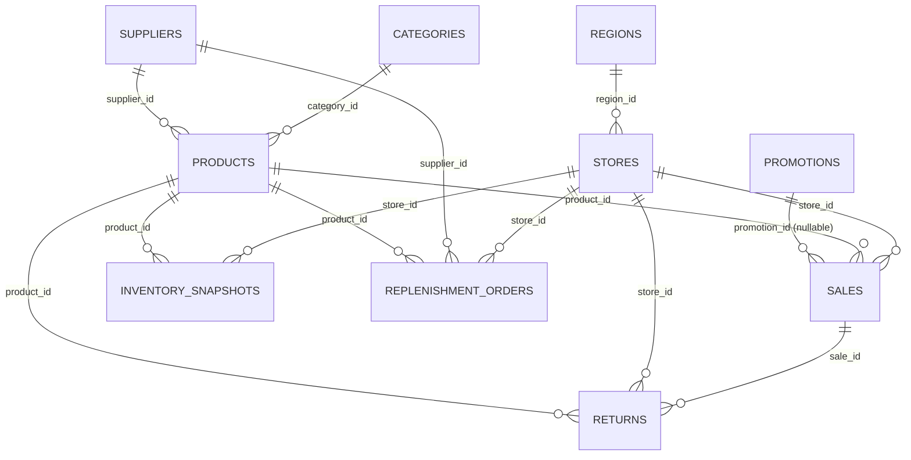

# Retail Analytics Schema (SQL-First)

This document describes the retail analytics database schema implemented in `apps/api` using SQLAlchemy 2.x + Alembic migrations.

## Tables & purposes

- `regions`
  - Stores geographic grouping (region_name, timezone).
- `stores`
  - Physical store locations (store_name, store_code) tied to a `region`.
- `categories`
  - Product grouping (category_name, department).
- `suppliers`
  - Upstream vendors (supplier_name, supplier_lead_time_days).
- `products`
  - SKUs sold by the business (sku, product_name, unit_cost, base_price) tied to `categories` and optionally `suppliers`.
- `promotions`
  - Discounts/promotions with discount_type/value and active date ranges.
- `sales`
  - Transactional sales facts (sale_date, sale_ts, store_id, product_id, optional promotion_id) plus denormalized revenue/margin measures.
- `inventory_snapshots`
  - Inventory positions by store/product over time (snapshot_date/snapshot_ts, stock_on_hand, reorder_point, target_stock_level).
- `returns`
  - Returns linked to `sales`/`product` (return_date/return_ts, return_quantity, refund_amount, return_reason).
- `replenishment_orders`
  - Replenishment orders linked to `stores`, `suppliers`, and `products`, including delivery dates and delay_days.

## Key relationships

- one `regions` row has many `stores` rows (`stores.region_id -> regions.id`)
- one `categories` row has many `products` rows (`products.category_id -> categories.id`)
- one `suppliers` row has many `products` rows (`products.supplier_id -> suppliers.id`, nullable)
- `sales` belong to `stores` and `products` (`sales.store_id`, `sales.product_id`)
- `sales` may optionally reference `promotions` (`sales.promotion_id` nullable)
- `inventory_snapshots` belong to `stores` and `products`
- `returns` belong to a `sales` record and a `product` (`returns.sale_id`, `returns.product_id`) and also to a `store`
- `replenishment_orders` belong to `stores`, `suppliers`, and `products`

## Example business questions (at least 15)

1. What are the top 10 products by `net_revenue` for the last 30 days?
2. How does revenue and gross margin vary by `region` for the last quarter?
3. Which categories have the highest gross margin rate over the last month?
4. What is the discount impact: compare gross vs net revenue during active promotions?
5. For each promotion, what is the average discount amount and net revenue lift (promo period vs prior period)?
6. Which stores are underperforming net revenue compared to their region average?
7. Which products show stockout risk: days where `stock_on_hand` < `reorder_point`?
8. What are the most frequent out-of-stock/reorder candidates by store and category?
9. How does inventory trend for a product (stock_on_hand over time) across stores?
10. What is the return rate by category: returns quantity divided by sold quantity?
11. Which return reasons are most common for a category or supplier’s products?
12. How do promotions affect return rates for the products that were discounted?
13. Supplier delay analysis: average `delay_days` by supplier for delivered replenishment orders.
14. Supplier/product delay analysis: which supplier-product pairs have the worst average delay?
15. On-time delivery rate: what fraction of replenishment orders have `delay_days` <= 0 by supplier?

